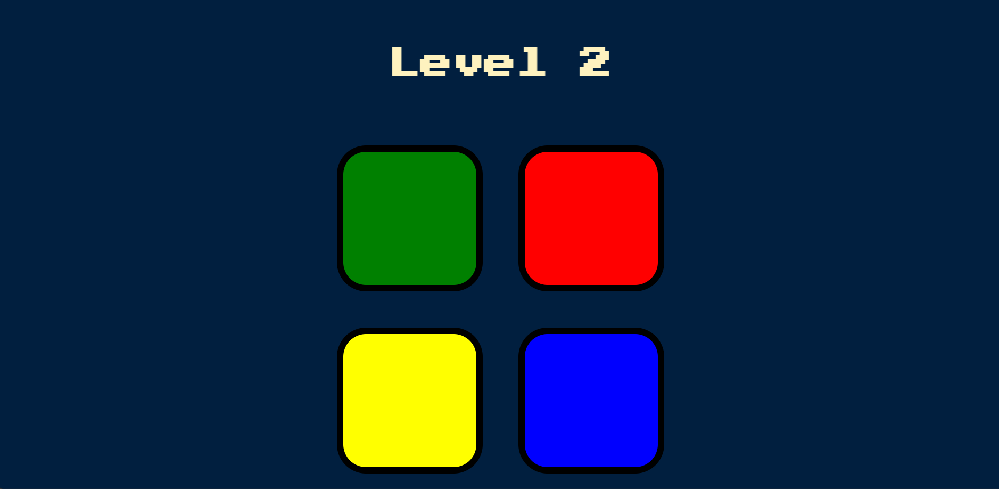
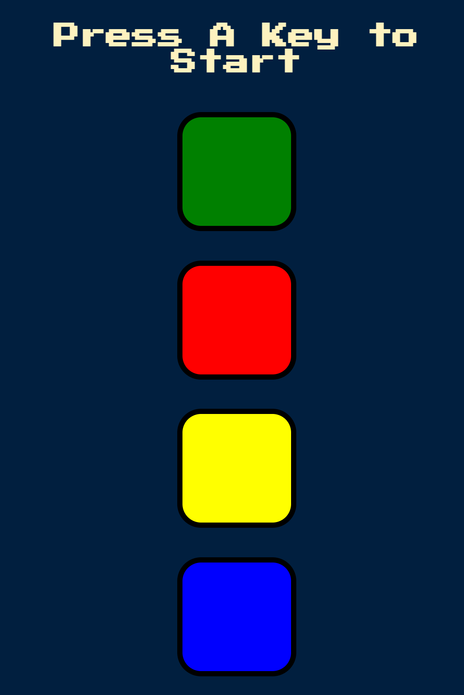

## Table of contents

  - [The challenge](#the-challenge)  
  - [How this game is played](#How-this-game-is-played)
  - [Screenshot](#screenshot)
  - [Built with](#built-with)
  - [What I learned](#what-i-learned)
  - [Author](#author)

### The goal 
 -  build Simon game.
 -  Features:
    1. The number of levels will rise as the player advances in the game.
    2. If the user loses it, "game over" appears, then "press any key" after a short while.
    3. To start the game, press any key on the keyboard.

### How this game is played
    1. press any key on keyboard to start.
    2. The game will flash a sequence of colored lights.
    3. Try to remember the order of the lights.
    4. Tap the colors in the same order for every new level. 
    5. If you miss the order, game over.

    Here is example:
        Level 1:
            Simon: Red
            You: Tap the red button. 
        
        Level 2:
            Simon: Blue
            You: Tap the red button, then the blue button.

        Level 3:
            Simon: Blue
            You: Tap the red button, then the blue button, then again blue button.

        Level 4: 
            Simon : Green
            You: Tap the red button, then the blue button, then again blue button, then the green button.
        
    As you can see, the game starts with simple sequences and gets more challenging as you progress. You must remember the order of the flashing lights and repeat them correctly to continue playing.
 

### Screenshot

- desktop view:

- mobile view:

### Built with

- HTML5 markup
- CSS properties
- JavaScript
- jQuery

## What I learned
-  how to use jQuery.
-  to change text dynamically.
-  to set time out to a specific code.
-  to set animation and sounds to the button when clicked.
-  to detect keyboard buttons.
-  to push values into an array and make it empty when needed.

## Author

- Frontend Mentor (to see author challenges) - (https://www.frontendmentor.io/profile/Ajinkya9834)
- My LinkedIn Profile - (www.linkedin.com/in/ajinkya-hajare)

